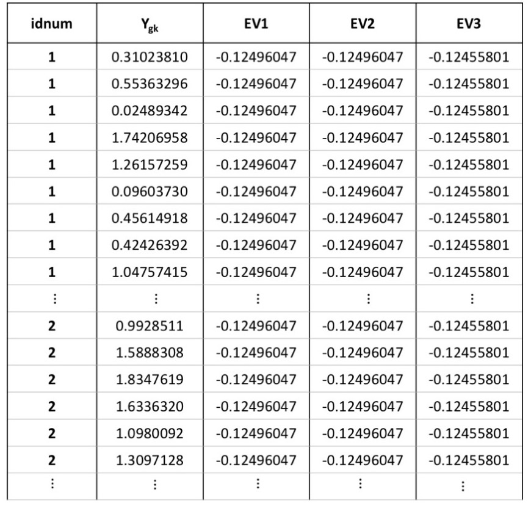

---
title: "A Tutorial on Modeling fMRI Data using a General Linear Model"
---

# R Tutorial
In this tutorial, we will simulate and then model the time series of a
single voxel for n = 10 subjects. Each subject has 180 volumes of data
during which they perform an N-back experiment.

## Description of the Experiment
First, let us load some packages that are required to run this analysis. 
The package <tt>nlme</tt> has functions that will allow us to fit mixed effects models.

```{r,eval=TRUE,warning=FALSE,message=FALSE}
library(nlme)
```

We will also load the package <tt>fmri</tt> which contains a function that allows us to convolve our stimulus, creating an EV.
```{r,eval=TRUE,warning=FALSE,message=FALSE}
library(fmri)
```

Let us specify some of the basic parameters of our experiment. 

<tt>n</tt> is the number of subjects.
```{r,eval=TRUE,warning=FALSE,message=FALSE}
n <- 10
```

As above, <tt>T</tt> is the length of our voxel-wise time-series (i.e. number of
volumes per subject). We will collect 180 volumes per subject. Let us
assume that each volume is acquired over 2 seconds. This means that
the duration in time of our subject scan is 6 minutes.

```{r,eval=TRUE,warning=FALSE,message=FALSE}
T <- 180
```
We propose an example task with 4 conditions, and assumed one task run per subject. The conditions are as follows: 

* $EV_b$ (Fixation cross): Subject sees a white fixation cross on a black screen and lets thoughts wander.
* $EV_1$ (0-Back): Subject sees a series of letters, and presses a button when the letter is "X".
* $EV_2$ (1-Back): Subject sees a series of letters, and presses a button when the letter is the same as the one that preceded it. This task engages working memory.
* $EV_3$ (2-Back): Subject sees a series of letters, and presses a button when the letter is the same as the one that was presented two letters ago. This task engages working memory and is more difficult than 1-Back.

***

Let us assume that we present each subject first with the fixation
cross, then with a 0-back condition, a 1-back condition, and then a 2-back condition for
15 volumes (30 seconds) for each condition. We will repeat this sequence (60
volumes total, or 120 seconds) three times. Normally, the order of the
conditions would be randomized to prevent order-dependent effects, and we
would need to obtain more data to achieve enough statistical power to
actually detect an effect. However, the design presented here is easy to
visualize, and so we will continue with these caveats.

It is now easy to describe our experiment stimuli with sequences of
ones and zeros. The stimuli corresponding to each condition are set to
one for each volume that the subject is presented with the condition,
and zero at all other times.

```{r, eval=TRUE,warning=FALSE,message=FALSE}
emptyblock <- rep(0,15)
taskblock <- rep(1,15)
EVstim1 <- rep(c(emptyblock,taskblock,emptyblock,emptyblock),3)
EVstim2 <- rep(c(emptyblock,emptyblock,taskblock,emptyblock),3)
EVstim3 <- rep(c(emptyblock,emptyblock,emptyblock,taskblock),3)
```

We can plot these stimuli:

```{r blockdesign, eval=TRUE, warning=FALSE, message=FALSE, fig.cap='Boxcar plot for EV1, EV2 and EV3', fig.align='center'}
plot(1:T, EVstim1,type="n", ylab="", xlab="Volume Number")
lines(1:T,EVstim1)
lines(1:T,EVstim2,col="red")
lines(1:T,EVstim3,col="blue")
legend("topright", c("EVstim1", "EVstim2", "EVstim3"), lty=c(1,1,1), col=c("black","red", "blue", cex=.75))
```


While it is easy to see with this "boxcar" plot what the timings of
the stimuli are, these stimuli need to be convolved with a hemodynamic
response function to account for the delay between when stimuli are
presented and when the BOLD response peaks. This can be done with the
<tt>fmri.stimulus</tt> function from the <tt>fmri</tt> package. We use
the canonical hemodynamic function as an example below.

```{r, eval=TRUE,warning=FALSE,message=FALSE}
baseonsets <- c(15, 15+60, 15+2*60) 
EV1 <- fmri.stimulus(scans=T, onsets=baseonsets,durations=c(15,15,15))
EV2 <- fmri.stimulus(scans=T, onsets=(baseonsets+15),durations=c(15,15,15))
EV3 <- fmri.stimulus(scans=T, onsets=(baseonsets+30),durations=c(15,15,15))
```

We can plot these EVs to visualize them:
```{r evs, eval=TRUE, warning=FALSE, message=FALSE, fig.cap='EVs convolved with the hemodynamic response function', fig.align='center'}
plot(1:T, EV1,type="n", ylab="", xlab="Volume Number")
lines(1:T,EV1)
lines(1:T,EV2,col="red")
lines(1:T,EV3,col="blue")
legend("topright", c("EV1", "EV2", "EV3"), lty=c(1,1,1), col=c("black","red", "blue", cex=.75))
```

In summary, we expect the BOLD signal to be related to these EVs in
voxels that are associated with these task conditions. 

## Simulating Individual Subject Data 
Now that we have created our design matrix, we need to simulate data
for one voxel in `r n` subjects. Recall the first level model for the BOLD signal at each voxel:

\begin{equation}
\begin{aligned}
  Y_k &= X_k \beta_k + e_k
  &= 1\beta_0 + X_{k1}\beta_1 + X_{k2}\beta_2 + X_{k3}\beta_3 + e_k
\end{aligned}
\end{equation}

---
#Recall that before we can do a group-level analysis, we need to fit a
#model at the individual subject level. 
---

For each subject $k$, where $k=1\ldots{}N$, the above equation 
models the BOLD signal at a single voxel, $Y_k$. 
$X_k$ is our design matrix of EVs that we created in the description 
of the experiment, $\beta_k$ is a column
vector of beta co-efficients (that the model tries to estimate) for
each EV in the design matrix $X_k$, and $e_k$ is a column vector of
residuals for each voxel.

Remember that we do not model the baseline $EV_b$ because doing so
will produce a rank deficient design matrix, but we do model $EV_1$, $EV_2$ and $EV_3$. Including the intercept, the
design matrix for the first level ($X_k$) has four columns. We assume
that there are $T$=`r T` volumes of fMRI data in the fMRI timeseries for
each subject.

\begin{equation}
X_k = \begin{bmatrix}
	1 & EV_{11} & EV_{21} & EV_{31}\\
	1 & EV_{12} & EV_{22} & EV_{32} \\
	1 & EV_{13} & EV_{23} & EV_{33} \\
	\vdots & \vdots & \vdots & \vdots \\
	1 & EV_{1T} & EV_{2T} & EV_{3T}
	\end{bmatrix} = \begin{bmatrix} X_{k0} & X_{k1} & X_{k2} & X_{k3}\end{bmatrix}
\end{equation}

To simulate voxel-wise data using this matrix, we will specify fixed values
for the coefficients for the intercept & EVs. 

```{r, eval=TRUE,warning=FALSE,message=FALSE}
beta0.fixed <- 3
beta1.fixed <- 2
beta2.fixed <- 5
beta3.fixed <- 4

```

Thus, for subject 1, 
\begin{equation}
  \beta_1 = \begin{bmatrix}
  	\beta_{10} \\
  	\beta_{11} \\
  	\beta_{12} \\
  	\beta_{13} \\
  	\end{bmatrix} = \begin{bmatrix}
  	`r round(beta0.fixed,2)` \\
  	`r round(beta1.fixed,2)`\\
  	`r round(beta2.fixed,2)` \\
  	`r round(beta3.fixed,2)`\\
  	\end{bmatrix}
\end{equation}

The only thing we are missing now is $e_k$, the residual within-subject variance. Let us assume that this follows a normal distribution with a standard deviation for each subject of 0.5.

```{r, eval=TRUE,warning=FALSE,message=FALSE}
within.sd <- 0.5
```

We can now simulate the time series for a single voxel for the first subject.
```{r,eval=TRUE,warning=FALSE,message=FALSE}
y1 <- beta0.fixed + EV1*beta1.fixed + EV2*beta2.fixed + EV3*beta3.fixed + rnorm(T, 0, within.sd)
```

Let's have a look at the voxel time series (y1) for the first 75 time points for subject 1.
```{r, echo=FALSE, eval=TRUE,warning=FALSE,message=FALSE}
y1[1:75]
```

We can simulate this voxel time series in the same way for the second subject.
```{r,eval=TRUE,warning=FALSE,message=FALSE}
y2 <- beta0.fixed + EV1*beta1.fixed + EV2*beta2.fixed + EV3*beta3.fixed + rnorm(T, 0, within.sd)
```

And for the third subject.
```{r, eval=TRUE,warning=FALSE,message=FALSE}
y3 <- beta0.fixed + EV1*beta1.fixed + EV2*beta2.fixed + EV3*beta3.fixed + rnorm(T, 0, within.sd)
```

Now, we can look at the BOLD signal for the first 3 subjects for a single voxel:
```{r voxel, echo=FALSE, eval=TRUE, warning=FALSE, message=FALSE, fig.cap='Simulated BOLD signal for the first 3 subjects', fig.align='center'}
plot(y1, type='l', col='blue', ylab='BOLD Signal', xlab='Volume Number')
lines(y2, col='red')
lines(y3, col='dark green')
legend("topright", c("Subject 1", "Subject 2", "Subject 3"), lty=c(1,1,1), 
       col=c("blue", "red", "dark green"), cex=0.75)
```

Each of these subjects responds exactly the same way to the EVs, with
the same degree of individual variation. In reality, this is unlikely
to be the case. We need to simulate more realistic individuals by allowing their $\beta$ values to vary around this mean value.

## Group-level Analysis
Now we can simulate the data for all subjects, and add
between-subject variation for the beta weights. Then, we will perform a
group-level analysis for that single voxel so that we can generalize any
hypothesis testing we do to the population of interest. Note that
actual fMRI analysis is much more complex because we are usually
modeling thousands of voxels at once, as opposed to a single voxel,
for a larger subject pool.

A single voxel can be modeled according to the following
equation at the group level:

\begin{equation}
	Y_{g} = 1 \beta_0 + X_{1}\beta_1 + X_{2}\beta_2 + X_{3}\beta_3 +
	b_{0} + X_{1}(mat)b_{1} + X_{2}(mat)b_{2} + X_{3}(mat)b_{3} + e
\end{equation}

Where $1$ is a column vector of ones, $X_1=(X_{11},\ldots X_{N1})'$,
$X_2=(X_{12},\ldots X_{N2})'$, $X_3=(X_{13},\ldots X_{N3})'$, $b_0=(b_{10},...,b_{N0})'$,
$b_1=(b_{11},...,b_{N1})'$, $b_2=(b_{12},...,b_{N2})'$, $b_3=(b_{12},...,b_{N3})'$, 
$X_{1}(mat)=diag(X_{11}, X_{21}, \ldots, X_{N1})$, 
$X_{2}(mat)=diag(X_{12}, X_{22}, \ldots, X_{N2})$, 
$X_{3}(mat)=diag(X_{13}, X_{23}, \ldots, X_{N3})$. 
In other words, $X_{1}(mat)$, $X_{2}(mat)$ and $X_{3}(mat)$ are diagonal matrices with the column vectors being the diagonal entries. 

In this model, $Y_{g}=(Y_1, Y_2, \ldots, Y_N)$ is a vector that contains the time series of
the voxel for all subjects.


$\beta_{0}$ is the fixed intercept.  $\beta_{1}$ represents the
population effect for $EV_1$,  $\beta_{2}$ is the population
effect for $EV_2$, and $\beta_{3}$ is the population effect for
$EV3$.
 
With mixed effects modeling, we can model the between-subjects
variance around the population mean for each EV. These will be the
random effects that we will later on specify in the model.

$b_{0}$ is the random effect for the intercept, $b_{k1}$ is the random
effect for $EV_1$ (i.e. it reflects subject to subject variability
around the population effect $\beta_{1}$), $b_{k2}$ is the random
effect for $EV_2$, and $b_{k3}$ is the random effect for
$EV_3$. Finally, $e_k$ represents within-subject error.

To simulate between-subjects variance, we assume a random intercept and slopes. We specify the variances of the intercept and slopes and then draw samples from their corresponding normal distributions. 
We set a seed so that this code will run the same way repeatedly.

```{r, eval=TRUE,warning=FALSE,message=FALSE}
set.seed(123)
sd0.random <- 1.5
sd1.random <- 1
sd2.random <- .5
sd3.random <- .8

beta0.betweensub <- rnorm(n, 0, sd0.random)
beta1.betweensub <- rnorm(n, 0, sd1.random)
beta2.betweensub <- rnorm(n, 0, sd2.random)
beta3.betweensub <- rnorm(n, 0, sd3.random)
```

The standard deviation of the intercept across
individuals was set equal to <tt>sd0.random</tt>, or `r sd0.random`. 
Let's look at the actual random effect for our intercept, 
<tt>beta0.betweensub</tt>, for all `r n` subjects.

```{r, echo=FALSE}
beta0.betweensub
```
The sample standard deviation of these values is `r round(sd(beta0.betweensub),2)`.

Now, we will simulate the full timeseries $Y_g$ at a single voxel. Recall that $Y_g$ is the concatenated time series data for all of the $N$ subjects.

To derive the voxel time series for each subject, we have to account for the
fixed effects and random effects for each EV, the intercept, and
within-subjects variability.

To create this vector, we define the function
<tt>generateSubjectVoxelData</tt>, which creates the data for a single
subject using the beta weights, as well as the between- and within-subjects error
variances that we defined above. We then call this function for all
<tt>n</tt> subjects using <tt>lapply</tt>. This returns the
vectors for each subject as a list.

```{r, eval=TRUE,warning=FALSE,message=FALSE}

generateSubjectVoxelData <- function(i) {
  Y <- beta0.fixed + EV1*beta1.fixed + EV2*beta2.fixed + EV3*beta3.fixed + beta0.betweensub[i] + EV1*beta1.betweensub[i] + EV2*beta2.betweensub[i] + EV3*beta3.betweensub[i] + rnorm(T, 0, within.sd)
  return(Y)	
}

allsubjs <- lapply(1:n, generateSubjectVoxelData)

```

The <tt>lme</tt> function that we will use later expects a data frame in the
*long* data format. This is a picture of what this looks like. 
This data frame will contain the voxel data <tt>Y.g</tt>, 
the EVs, and the identifier for all subjects "stacked"
on top of each other, so that each row contains the value of the BOLD
signal at a single voxel for one volume. Thus, the entire data frame
will contain <tt>N*T</tt>, or `r n*T` observations.

```{r longdataframe, echo = FALSE, fig.show='hold', out.width='50%', fig.cap='Long data frame with example voxel data for all subjects; idnum is the subject number.', fig.align='center'}

```

Our first step towards creating this data frame is to create a single vector,
<tt>Y.g</tt>, which is equivalent to $Y_{g}$ from the equation above.
This is a vector that contains the time series of the voxel across all
subjects.  To do this, we collapse the list of subject voxel vectors 
using <tt>unlist</tt>.

```{r, eval=TRUE,warning=FALSE,message=FALSE}
Y.g <- unlist(allsubjs)
```

We will not print the entire variable <tt>Y.g</tt> because it is a
very long vector that will take up a lot of space. However, we can
look at a particular subject's voxel time series by subsetting the vector. 
For example, subject 2's voxel time series is located in indices (T+1 to 2*T).

```{r, eval=TRUE,warning=FALSE,message=FALSE}
print(Y.g[(T+1):(2*T)])
```

Our subjects are numbered 1 to `r n`. We need to generate a list of
subject identifiers to correspond to the voxel data in
<tt>Y.g</tt>. By convention, the vector of subject identifiers is
called <tt>idnum</tt>. We convert these integer subject identifiers
to factors.

```{r, eval=TRUE,warning=FALSE,message=FALSE}
idnum <- unlist(lapply(1:n,rep,T))
idnum <- as.factor(idnum)
```

Similarly, we need to replicate the EV vectors by the number of
subjects to create this data frame.
```{r, eval=TRUE,warning=FALSE,message=FALSE}
EV1.vec <- rep(EV1, n)
EV2.vec <- rep(EV2, n)
EV3.vec <- rep(EV3, n)
```

We can create our data frame <tt>voxeldat</tt>, for convenience. If we had additional nuisance covariates, they would be additional columns in this structure.
```{r, eval=TRUE,warning=FALSE,message=FALSE}
voxeldat <- data.frame(idnum, Y.g, EV1.vec, EV2.vec, EV3.vec)
```

Now, let's use the <tt>lme</tt> function from the <tt>nlme</tt> package to fit the group level model for our single voxel.
```{r, eval=TRUE,warning=FALSE,message=FALSE}
model1 <- lme(Y.g ~ 1 + EV1.vec + EV2.vec + EV3.vec,
              random = ~1 + EV1.vec + EV2.vec + EV3.vec  | idnum, data=voxeldat, method=c("ML"))

summary(model1)
```

We simulated our data without autocorrelation. In real fMRI data, autocorrelation is typically present.
One way to account for autocorrelation in our linear mixed effects analysis is to use the argument correlation to specify the assumed correlation structure. As an example, for an autoregressive process of order one, we could specify its form in the call to <tt>lme</tt> as follows.
```{r, eval=TRUE,warning=FALSE,message=FALSE}
model2 <- lme(Y.g ~ 1 + EV1.vec + EV2.vec + EV3.vec,
              random = ~1 + EV1.vec + EV2.vec + EV3.vec  | idnum, data=voxeldat, method=c("ML"), correlation=corAR1(form=~1|idnum))
```

We can compare these two models, and as expected, find that by the
AIC, the BIC, and the log-likelihood ratio, model 1 (without
autocorrelation) is superior to model 2 (with autocorrelation). 
```{r,eval=TRUE,warning=FALSE,message=FALSE}
anova(model1,model2)
```

We will focus now only on model 1. When we look at the fitted beta 
coefficients for the intercept and the EVs, we find that they are
pretty close to the mean of the true beta values that we had specified
above. To refresh your memory, our fixed beta values 
were $\beta_0$=`r beta0.fixed`, 
$\beta_1$=`r beta1.fixed`, 
$\beta_2$=`r beta2.fixed`, and
$\beta_3$=`r beta3.fixed`.

The estimated fixed effects match the specified values closely. They are unlikely to match perfectly, unless the sample size is every large.
```{r, echo = FALSE, eval = TRUE}
round(fixed.effects(model1), 3)
```

We can also compare the estimated standard deviations of the model to
the true standard deviations that we had specified. To do this, we
look at the printout summary of the model.

Under the *Random effects* section of the output from <tt>lme</tt>, the first column gives a readout of the estimated standard deviations. We can also see estimated standard deviations using the <tt>VarCorr</tt> function.
```{r, eval=TRUE,warning=FALSE,message=FALSE}
VarCorr(model1)
```

As a reminder, let us look at the standard deviations of the simulated data.
```{r, eval=TRUE,warning=FALSE,message=FALSE}
sd(beta0.betweensub)
sd(beta1.betweensub)
sd(beta2.betweensub)
sd(beta3.betweensub)
within.sd 
```

We see that the standard deviations estimated for the random effect match closely with the corresponding standard deviations of the simulated data. The standard deviations of the random effects also agree well with the true values. (It is not expcted that the estimates will agree exactly with the true values.) 
For reference, these were:
```{r,eval=TRUE,warning=FALSE,message=FALSE}
sd0.random
sd1.random
sd2.random
sd3.random
```

## Testing a Hypothesis (for a Specific Contrast)
Let us assume that we want to test whether the 1-Back condition is
associated with greater activation in the population than the 0-Back
condition. Statistically, this means we need to test whether $EV_2$
is greater than $EV_1$ at the population
level. Our null hypothesis would be that there is no difference in the
BOLD signal of the voxel between the two conditions (i.e., that they are equal). 
Recall that in our simulations, we set $\beta_1=`r beta1.fixed`$ 
and $\beta_2=`r beta2.fixed`$.

Therefore,

$H_{0}: EV_2 = EV_1$

$H_{1}: EV_2 > EV_1$

To ask whether $EV_2$ > $EV_1$, we could reformulate the model so that the
effect of this contrast is estimated directly. This is done by simple
algebraic manipulation. In our first-level model, we could write

\begin{equation}
	\begin{aligned}
		Y &= \beta_{0} + X_{1}\beta_{1} + X_{2}\beta_{2} + X_{3}\beta_{3} + e \\
		  &= \beta_{0} + (X_{1} + X_{2} - X_{2})\beta_{1} + X_{2} \beta_{2} + X_{3}\beta_{3} + e \\
		  &= \beta_{0} + X_{1}\beta_{1} + X_{2}\beta_{1} - X_2\beta_1 + X_2 \beta_2  + X_3 \beta_3 + e \\
		  &= \beta_{0} + (X_{1} + X_{2})\beta_{1}  + X_{2}(\beta_{2} - \beta_{1}) + X_{3}\beta_{3} + e \\
  \end{aligned}
\end{equation}

Basically, we have now changed the EVs so that the $\beta$ weight for the second EV now directly tests the contrast of interest. We can interpret the significance of this coefficient directly.

In R, this adjusted model specification is as follows (note that we do not make use 
of the <tt>voxeldat</tt> data structure here and just refer to the vectors that we create).
```{r, eval=TRUE,warning=FALSE,message=FALSE}
EV1.adj <- EV1.vec + EV2.vec
EV2.adj <- EV2.vec
model3 <- lme(Y.g ~ 1 + EV1.adj + EV2.adj + EV3.vec, random = ~1 + EV1.adj + EV2.adj + EV3.vec|idnum, method=c("ML")) 
```

Let's have a look at the results.
```{r echo=FALSE, eval = TRUE}
summary(model3)
```

The t-statistic and the p-value for this contrast are now the t-statistic and p-value for the fixed effect for <tt>EV2.adj</tt>.
We see here that our p-value is significant if we take
$\alpha$=0.05. In other words, we can reject the null hypothesis.

---
#```{r, eval=TRUE,warning=FALSE,message=FALSE}
#contr <- c(0, 0, 1, 0)
#out <- anvao(model3, L=contr)
#tstat <- t(contr) %*% model3$coefficients$fixed / sqrt(t(contr) %*% vcov(model3) %*% contr) 
#pvalue <- 1 - pt(tstat, df=out$denDF)
#print(pvalue[1,1])
#```
---

You could write your EVs from the beginning of your experimental
design to conform to the contrasts of interest in the way shown above, but this
kind of model rewriting of the model can be difficult and error prone. 
It is normally more straightforward to specify the EVs in a logical way and
to specify the contrast directly. 

In the following example, we use model 1
and set <tt>contr</tt> to be the linear combination $EV_2$ - $EV_1$.
Then, the $t$-statistic is calculated by dividing the linear
combination of the parameter estimates (as specified by the contrast)
by the square root of the variance of this linear combination.

```{r, eval=TRUE,warning=FALSE,message=FALSE}
contr <- c(0, -1, 1, 0)
out <- anova(model1, L=contr)
tstat <- t(contr) %*% model1$coefficients$fixed / sqrt(t(contr) %*% vcov(model1) %*% contr) 
pvalue <- 1 - pt(tstat, df=out$denDF)
```
We can see that the values obtained by specifying the contrast directly are indeed the same as we had obtained by recoding the contrast (<tt>tstat</tt> = `r round(tstat,2)` and <tt>pvalue</tt> = `r round(pvalue,2)`).

